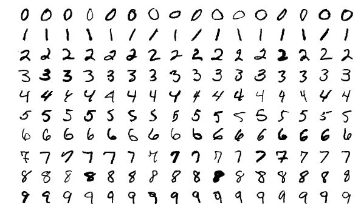

In the name of God

# MNIST images extractor
This repository extracts [MNIST](http://yann.lecun.com/exdb/mnist/) dataset images.

# Extract images
To extract MNIST dataset images, type the following command at the command prompt:
```
python3 ./mnist_images_extractor.py
```

Sample images from MNIST dataset:



# Dependencies
* Python 3
* numpy
* tensorflow
* imageio

# Links
* http://yann.lecun.com/exdb/mnist/
* https://github.com/amir-saniyan/MNISTImagesExtractor
